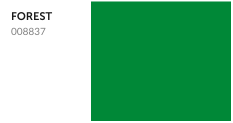
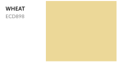

## Accent Colors

 

Forest is used for success messaging, lead time, and indicating active state; it's text-accessible against white, but not Charcoal.

Wheat is a highlight color used for text placed on charcoal during Black Friday. It is text-accessible against Charcoal, not white.
