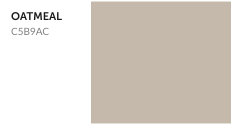

## Neutrals

   

Slate is a slightly lighter contrast color to Charcoal, used most frequently as a background color for small sections (such as the header that defines columns for line items in the cart) or to reduce the weight of text while maintaining accessibility. Text-accessible against white.

Seashell is exclusively a background color, best used for separating sections on marketing splash pages or as a full background for more dramatic pages. Text-accessible against Charcoal, but not white -- when using as a subdivider against white, make sure internal elements use methods other than color for establishing hierarchy.

Sky Blue and Oatmeal are specialized background colors -- currently Sky Blue only lives in the payment section of our checkout flow. Sky Blue is also used as a text color to be used on top of charcoal during Cyber Monday. Neither is text-accessible against white, so make sure internal elements use methods other than color for establishing hierarchy. Both are also AA Large against Charcoal, so normal-weight text inside this color must be 18px or larger, and bold text must be at least 14px.
