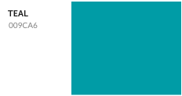
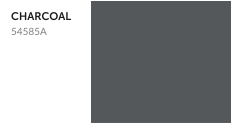
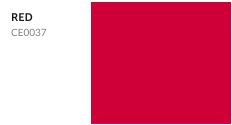
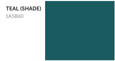
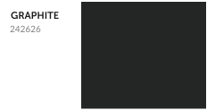
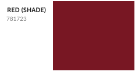

## Primary

  

Lovesac Teal is our primary brand color, used as an indicator for primary actions and as a background color for emphasized content zones; use judiciously, lest it lose its power. Note that this color only registers as WCAG AA Large when combined with white, so make sure any teal elements are sufficiently large, and that when combining it with white for text, ensure your font size is larger than 14px bold or 18px regular.

Lovesac Grey, or Charcoal, is our monochrome base and our replacement for black -- use liberally! You'll most frequently see this in our UI as text, secondary interactions, and boundaries.

Lovesac Red, or Cherry, should only be used for error messaging, or as a teal replacement during a major holiday/market share (Labor Day, Memorial Day, Christmas, and flash sales).

## Shades

  

These colors are only to be used as hover or active states for buttons colored with the primary three brand elements. The Teal shade is occasionally used as a contrast background color for Lovesac Teal. All are text-accessible against white.
