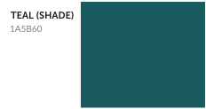

## Shades

  

These colors are only to be used as hover or active states for buttons colored with the primary three brand elements. The Teal shade is occasionally used as a contrast background color for Lovesac Teal. All are text-accessible against white.
