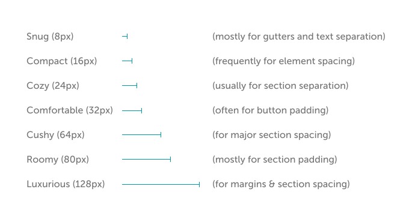

## Spacing Rhythm

When sizing objects or plotting out a screen layout, use factors or multiples of 8 to create an even spacing rhythm. We mostly use the values below to determine size, padding, and margin. While these aren't the only values we use (sometimes we use `4px` for gutters or button padding, and `200px` for CTA width), these values should cover a majority of your needs.

